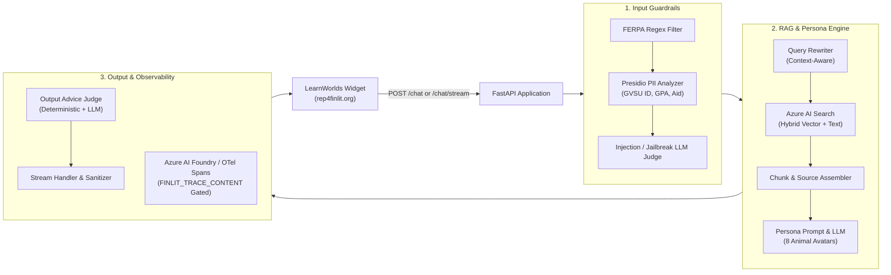
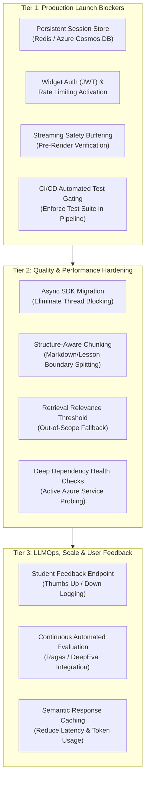

# FinLit Chatbot — Product & Technical Status Document

---

## 1. Goal

The **FinLit Chatbot** is an AI-powered educational assistant developed for Grand Valley State University (GVSU) and the REP4 initiative, integrated directly into the LearnWorlds learning platform (`rep4finlit.org`).

### Core Objectives
* **Personalized Financial Education:** Provide undergraduate and first-generation college students with engaging, accessible, and non-judgmental financial guidance grounded in GVSU’s core curriculum (budgeting, credit building, financial aid navigation, mindful spending, debt repayment, and investing foundations).
* **Adaptive Multi-Persona Experience:** Support 8 distinct animal avatar personas (Squirrel, Panda, Owl, Armadillo, Bee, Poodle, Rabbit, Octopus) to tailor tone, communication style, and response length to diverse student learning preferences.
* **Strict FERPA & Educational Compliance:** Safeguard student privacy via multi-tier PII/FERPA filtering, prevent unauthorized personalized financial/investment advice, neutralize prompt-injection attempts, and ground all responses in verified curriculum via Retrieval-Augmented Generation (RAG).

---

## 2. Summary

Over the past three months, the FinLit Chatbot backend transitioned from an exploratory RAG prototype into an enterprise-ready FastAPI microservice featuring streaming responses, multi-persona orchestration, layered guardrails, and OpenTelemetry observability.

### Architectural & Operational Baseline
* **Core Stack:** FastAPI async application, LangChain orchestration, Azure OpenAI (`gpt-4o-mini`, `text-embedding-3-large`), and Azure AI Search (Hybrid Vector + Lexical retrieval).
* **Safety & Compliance:** Multi-layered defense incorporating deterministic regex scanners, Microsoft Presidio NER (with custom GVSU entity detectors), and temperature-zero LLM safety judges.
* **Observability:** Distributed tracing instrumented across the request lifecycle using OpenTelemetry and Azure AI Foundry / Application Insights, with content logging gated for student privacy.
* **Audit & Readiness:** Completed architectural, security, and LLMOps readiness reviews to establish a scaling path for 1,000+ concurrent students.

---

## 3. Accomplishments

### A. RAG Pipeline & Data Processing
* **Curriculum Ingestion:** Cleaned and structured 50+ GVSU financial literacy transcripts across 6 core course modules; established automated chunking with module, lesson, and video manifest metadata.
* **Hybrid Search Integration:** Configured Azure AI Search with dense vector embeddings (`text-embedding-3-large`) and full-text keyword indexing for context retrieval with source attribution.
* **Retrieval Benchmarking:** Developed an automated evaluation tool (`eval_retrieval.py`) using golden Q&A pairs to evaluate semantic retrieval quality and citation accuracy.

### B. FERPA Compliance & Input/Output Guardrails
* **Presidio PII Analyzer (`pii_detector.py`):** Configured Microsoft Presidio for standard PII entities (SSN, credit card, email, phone) and custom GVSU recognizers (student G-numbers, GPA disclosures, financial aid/loan balance disclosures).
* **Two-Tier Input Guardrails (`guardrails.py`):**
  * *Deterministic Pre-Filter:* High-confidence regex rules to block FERPA-protected queries and prompt-injection keywords instantly.
  * *AI Safety Judge:* Dedicated LLM classifier evaluating borderline PII and sophisticated jailbreak attempts.
* **Output Advice Prevention:** Built a dual-layer output scanner (`looks_like_advice` + `ajudge_output`) to prevent the model from dispensing personalized investment, tax, or legal advice.

### C. Multi-Persona & Streaming Infrastructure
* **8 Persona Voice Engine (`avatars.py`, `chain.py`):** Structured dedicated system prompts, behavioral guidelines, and per-avatar `response_shape` parameters to ensure consistent persona voices.
* **Real-Time Streaming (`/chat/stream`):**
  * Implemented an NDJSON/SSE streaming endpoint for real-time frontend responses.
  * Eliminated internal token leaks during query re-writing.
  * Enforced a consistent stream completion contract (`{"type": "done"}` across all exit states).
* **Guarded History Synchronization:** Implemented `sync_guarded_history` to overwrite blocked AI responses in session memory, preventing jailbreak extraction through multi-turn dialogue.

### D. Telemetry & Cloud Deployment
* **Azure AI Foundry Tracing (`tracing.py`, `TRACING.md`):** Configured OpenTelemetry spans across the entire request flow (`chat_request`, `input_guardrail`, `rag.query_rewrite`, `rag.retrieval`, `output_guardrail`).
* **Privacy-Safe Telemetry Controls:** Implemented the `FINLIT_TRACE_CONTENT` switch, ensuring student query text is never exported to Azure Application Insights unless explicitly enabled in controlled dev environments.
* **Deployment Readiness:** Configured Azure App Service deployment workflows, dependency locks, and rate limiting infrastructure (`slowapi`).

---

## 4. Up Next

The roadmap is organized into three sequential priority tiers to transition the platform from pilot testing to large-scale production serving 1,000+ concurrent students.

### Tier 1: Production Launch Blockers
* **Persistent Session Store (Redis / Azure Cosmos DB):** Migrate from in-memory Python dictionaries to an external cache with a 1-hour time-to-live (TTL), enabling horizontal multi-instance scaling without session loss.
* **Authentication & Rate Limiting Enforcement:** Implement JWT validation for requests originating from the LearnWorlds frontend widget and activate the installed `slowapi` rate limiter to safeguard against abuse and Azure OpenAI quota exhaustion.
* **Streaming Safety Buffering:** Buffer initial streaming output tokens so that any potential output safety violations are intercepted before text renders in the student's browser.
* **CI/CD Automated Test Gating:** Update deployment pipelines to require all existing test suites (`test_guardrails.py`, `test_chat_endpoint.py`, `test_tracing.py`) to pass before releasing updates to Azure App Service.

### Tier 2: Quality & Performance Hardening
* **Async SDK Migration:** Transition synchronous OpenAI and Azure Search client calls in `chain.py` to native `AsyncOpenAI` and async search methods to improve concurrency under high load.
* **Structure-Aware Chunking:** Update data preprocessing to split transcripts along natural lesson and topic headings rather than arbitrary word counts, preserving context around definitions and key financial concepts.
* **Retrieval Relevance Thresholding:** Enforce a minimum score threshold in `retrieve()` so out-of-scope or unrelated questions trigger a graceful educational fallback rather than forcing answers from irrelevant material.
* **Deep Dependency Health Checks:** Enhance `/health` to actively probe connectivity to Azure OpenAI and Azure AI Search, ensuring load balancers detect upstream service interruptions immediately.

### Tier 3: LLMOps, Scale & User Feedback
* **Student Feedback Endpoint:** Implement a `/feedback` endpoint enabling thumbs up/down ratings and qualitative feedback directly from the chat widget to inform continuous prompt optimization.
* **Continuous Automated Evaluation:** Integrate automated RAG evaluation frameworks (e.g., Ragas or DeepEval) to systematically score faithfulness, relevance, and persona consistency on code changes.
* **Semantic Response Caching:** Add a semantic caching layer for recurring general questions (e.g., "What is a FICO score?", "How does FAFSA work?") to reduce inference costs and latency.
